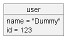

# Technology Stack

| Uses              | Technology                  |
| ----------------- | --------------------------- |
| VCS               | Github                      |
| build tool        | Maven                       |
| Language          | Java17                      |
| Middleware        | Spring Boot                 |
| Data Store        | MySQL                       |
| Testing           | Junit, Mockito, Spring Test |
| E2E Testing       | ??                          |
| CI Server         | Github action               |
| Containerization  | Docker                      |
| API documentation | Open api                    |
| Event streaming   | Kafka                       |

# Frameworks

- Java spring boot
  - Spring security
  - Spring kafka
  - Spring actuator
  - Spring open api
  - Spring validation
- Hibernate

# Components diagram

# Data model

# API table

| URL | Verb | Roles | Header/query param | Request body | Validation | Request response | Description |
| --- | ---- | ----- | ------------------ | ------------ | ---------- | ---------------- | ----------- |
|     |      |       |                    |              |            |                  |             |
