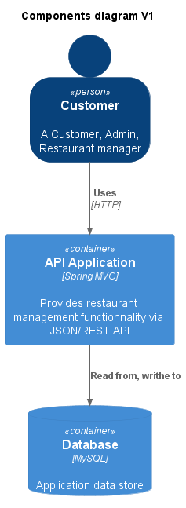
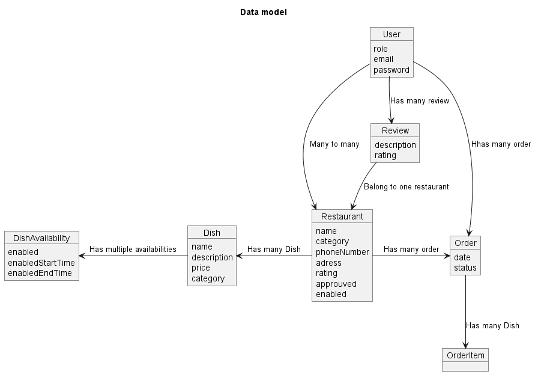

# Technology Stack

| Uses              | Technology                  |
| ----------------- | --------------------------- |
| VCS               | Github                      |
| build tool        | Maven                       |
| Language          | Java17                      |
| Middleware        | Spring Boot                 |
| Data Store        | MySQL                       |
| Testing           | Junit, Mockito, Spring Test |
| E2E Testing       | ??                          |
| CI Server         | Github action               |
| Containerization  | Docker                      |
| API documentation | Open api                    |
| Event streaming   | Kafka                       |

# Frameworks

- Java spring boot
  - Spring security
  - Spring kafka
  - Spring actuator
  - Spring open api
  - Spring validation
- Hibernate

# Components diagram

> V2 will add Kafka

# Data model

# API table

[Visit this google sheet](https://docs.google.com/spreadsheets/d/e/2PACX-1vSPEpldQyCAxk1h4q838IgxXxUpPw1-0ML16XIWEZRSnWQWWheGktlw3CC9waiqC29JpxzmEcVSRtK1/pub?gid=0&single=true&output=pdf)
